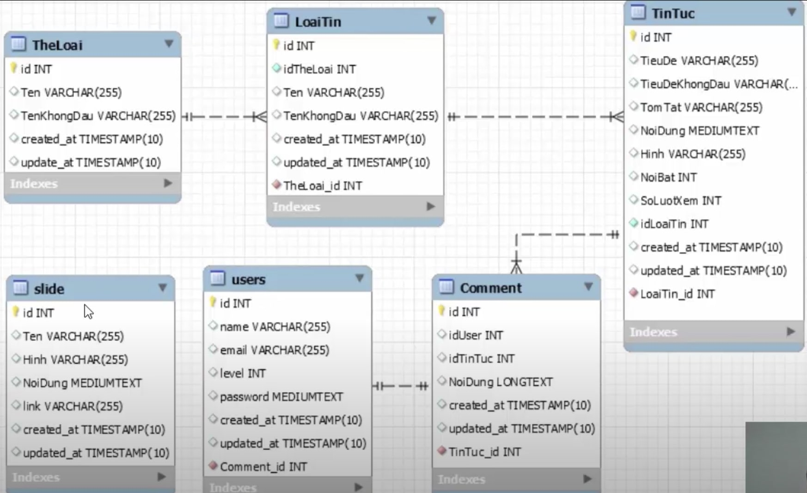
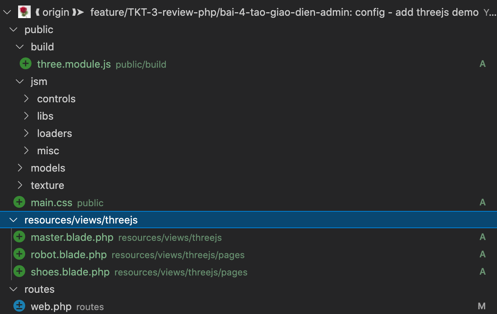

[](https://laravel.com)
[](https://travis-ci.org/laravel/framework)
[](https://packagist.org/packages/laravel/framework)
[](https://packagist.org/packages/laravel/framework)
[](https://packagist.org/packages/laravel/framework)

# Ghi chú review lại kiến thức php

1. Các phần route, truyền param route, validate route, định danh route, group route khá là đơn giản nên không có lệnh tạo đặc biệt. Chúng ta chỉ xem các PR code example và làm theo.
2. Từ các phần có quan trọng sẽ ghi chú lệnh vào đây

## Controller

### Lệnh tạo controller

```php
php artisan make:controller CONTROLLER_NAME
```

### Cách Dùng

```php
Để dùng được cần tạo route đón controller.
```

### Lỗi đã gặp

1. Target class controller does not exist - Laravel 8  
   [Cách Fix Tham Khảo ](https://stackoverflow.com/questions/63807930/target-class-controller-does-not-exist-laravel-8)

# CSDL Tin Tức



# Tạo migrate init csdl tin tức của Tôi Thiết Kế

## 1. Tạo Migrate:

---

#### `LƯU Ý: PHẦN MIGRATE NÀY CHƯA ĐỦ PHẦN THIẾT LẬP LIÊN KẾT KHOÁ NGOẠI`

#### `LƯỚT ĐẾN PHẦN MIGRATE BÊN DƯỚI ĐỂ SỬ DỤNG.`

---

`php artisan make:migration TheLoai --create=TheLoai`

> Created Migration: 2021_07_06_150146_the_loai

`database/migrations/2021_07_06_150146_the_loai.php`

```php
public function up()
    {
        Schema::create('TheLoai', function (Blueprint $table) {
            $table->increments('id');
            $table->string('Ten');
            $table->string('TenKhongDau');
            $table->timestamps();
        });
    }
```

`php artisan make:migration LoaiTin --create=LoaiTin`

> Created Migration: 2021_07_06_150351_loai_tin

`database/migrations/2021_07_06_150351_loai_tin.php`

```php
public function up()
    {
        Schema::create('LoaiTin', function (Blueprint $table) {
            $table->increments('id');
            $table->integer('idTheLoai')->unsigned();
            $table->string('Ten');
            $table->string('TenKhongDau');
            $table->timestamps();
        });
    }
```

`php artisan make:migration TinTuc --create=TinTuc`

> Created Migration: 2021_07_06_150708_tin_tuc

`database/migrations/2021_07_06_150708_tin_tuc.php`

```php
public function up()
    {
        Schema::create('TinTuc', function (Blueprint $table) {
            $table->increments('id');
            $table->string('TieuDe');
            $table->string('TieuDeKhongDau');
            $table->text('TomTat');
            $table->longText('NoiDung');
            $table->string('Hinh')->default('');// kg có default sẽ lỗi
            $table->integer('NoiBat');
            $table->integer('SoLuotXem')->default(0);// kg có default sẽ lỗi
            $table->integer('idLoaiTin')->unsigned();
            $table->timestamps();
        });
    }
```

`php artisan make:migration Comment --create=Comment`

> Created Migration: 2021_07_06_151231_comment

`database/migrations/2021_07_06_151231_comment.php`

```php
public function up()
    {
        Schema::create('Comment', function (Blueprint $table) {
            $table->increments('id');
            $table->integer('idUser')->unsigned();
            $table->integer('idTinTuc')->unsigned();
            $table->longText('NoiDung');
            $table->timestamps();
        });
    }
```

`php artisan make:migration Slide --create=Slide`

> Created Migration: 2021_07_06_151430_slide

`database/migrations/2021_07_06_151430_slide.php`

```php
public function up()
    {
        Schema::create('Slide', function (Blueprint $table) {
            $table->increments('id');
            $table->string('Ten');
            $table->string('Hinh');
            $table->longText('NoiDung');
            $table->string('Link');
            $table->timestamps();
        });
    }
```

## 2. Chạy Migrate:

`php artisan migrate`

> Created Migration: 2021_07_06_151430_slide

```php
Migrating: 2014_10_12_000000_create_users_table
Migrated:  2014_10_12_000000_create_users_table (50.82ms)
Migrating: 2014_10_12_100000_create_password_resets_table
Migrated:  2014_10_12_100000_create_password_resets_table (67.99ms)
Migrating: 2019_08_19_000000_create_failed_jobs_table
Migrated:  2019_08_19_000000_create_failed_jobs_table (34.49ms)
Migrating: 2021_07_06_150146_the_loai
Migrated:  2021_07_06_150146_the_loai (17.79ms)
Migrating: 2021_07_06_150351_loai_tin
Migrated:  2021_07_06_150351_loai_tin (19.50ms)
Migrating: 2021_07_06_150708_tin_tuc
Migrated:  2021_07_06_150708_tin_tuc (17.18ms)
Migrating: 2021_07_06_151231_comment
Migrated:  2021_07_06_151231_comment (17.24ms)
Migrating: 2021_07_06_151430_slide
Migrated:  2021_07_06_151430_slide (17.70ms)
```

> php artisan migrate:refresh

```php
Rolling back: 2021_07_06_151430_slide
Rolled back:  2021_07_06_151430_slide (9.07ms)
Rolling back: 2021_07_06_151231_comment
Rolled back:  2021_07_06_151231_comment (3.60ms)
Rolling back: 2021_07_06_150708_tin_tuc
Rolled back:  2021_07_06_150708_tin_tuc (2.69ms)
Rolling back: 2021_07_06_150351_loai_tin
Rolled back:  2021_07_06_150351_loai_tin (2.65ms)
Rolling back: 2021_07_06_150146_the_loai
Rolled back:  2021_07_06_150146_the_loai (1.87ms)
Rolling back: 2019_08_19_000000_create_failed_jobs_table
Rolled back:  2019_08_19_000000_create_failed_jobs_table (1.87ms)
Rolling back: 2014_10_12_100000_create_password_resets_table
Rolled back:  2014_10_12_100000_create_password_resets_table (2.15ms)
Rolling back: 2014_10_12_000000_create_users_table
Rolled back:  2014_10_12_000000_create_users_table (2.36ms)
Migrating: 2014_10_12_000000_create_users_table
Migrated:  2014_10_12_000000_create_users_table (126.44ms)
Migrating: 2014_10_12_100000_create_password_resets_table
Migrated:  2014_10_12_100000_create_password_resets_table (28.09ms)
Migrating: 2019_08_19_000000_create_failed_jobs_table
Migrated:  2019_08_19_000000_create_failed_jobs_table (33.57ms)
Migrating: 2021_07_06_150146_the_loai
Migrated:  2021_07_06_150146_the_loai (14.37ms)
Migrating: 2021_07_06_150351_loai_tin
Migrated:  2021_07_06_150351_loai_tin (16.21ms)
Migrating: 2021_07_06_150708_tin_tuc
Migrated:  2021_07_06_150708_tin_tuc (19.08ms)
Migrating: 2021_07_06_151231_comment
Migrated:  2021_07_06_151231_comment (18.64ms)
Migrating: 2021_07_06_151430_slide
Migrated:  2021_07_06_151430_slide (17.06ms)
```

## Insert dữ liệu mẫu

> Đã làm quen trong phần Seeder
> `database/seeders/DatabaseSeeder.php`

```php
use Illuminate\Support\Str;
public function run()
    {
        // \App\Models\User::factory(10)->create();
        \DB::table('users')->insert([
            ['name' => 'Toithietke', 'email' => Str::random(10).'@gmail.com', 'password' => bcrypt('Toithietke'), 'level' => 1],
            ['name' => 'Admin', 'email' => Str::random(10).'@gmail.com', 'password' => bcrypt('Admin'), 'level' => 2],
            ['name' => 'User', 'email' => Str::random(10).'@gmail.com', 'password' => bcrypt('User'), 'level' => 3],
            ['name' => 'Guest', 'email' => Str::random(10).'@gmail.com', 'password' => bcrypt('Guest'), 'level' => 4],
        ]);
        \DB::table('TheLoai')->insert([
            ['id' => 1, 'Ten' => 'Giáo Dục', 'TenKhongDau' => 'Giao Duc'],
            ['id' => 2, 'Ten' => 'Sức Khoẻ', 'TenKhongDau' => 'Suc Khoe'],
            ['id' => 3, 'Ten' => 'Đời Sống', 'TenKhongDau' => 'Doi Song'],
            ['id' => 4, 'Ten' => 'Du Lịch', 'TenKhongDau' => 'Du Lich'],
            ['id' => 5, 'Ten' => 'Hài', 'TenKhongDau' => 'Hai'],
            ['id' => 6, 'Ten' => 'Âm Nhạc', 'TenKhongDau' => 'Am Nhac'],
            ['id' => 7, 'Ten' => 'Võ Thuật', 'TenKhongDau' => 'Vo Thuat'],
        ]);
        \DB::table('LoaiTin')->insert([
            ['id' => 1, 'idTheLoai' => 1, 'Ten' => 'Học Tiếng Anh', 'TenKhongDau' => 'Hoc Tieng Anh'],
            ['id' => 2, 'idTheLoai' => 1, 'Ten' => 'Học Lập Trình', 'TenKhongDau' => 'Hoc Lap Trinh'],
            ['id' => 3, 'idTheLoai' => 2, 'Ten' => 'Bệnh Xương Khớp', 'TenKhongDau' => 'Benh Xuong Khop'],
            ['id' => 4, 'idTheLoai' => 7, 'Ten' => 'Võ Hàn Quốc', 'TenKhongDau' => 'Vo Han Quoc'],
            ['id' => 5, 'idTheLoai' => 7, 'Ten' => 'Võ Việt Nam', 'TenKhongDau' => 'Vo Viet Nam'],
        ]);
        \DB::table('TinTuc')->insert([
            ['id' => 1, 'idLoaiTin' => 2, 'TieuDe' => 'Html', 'TieuDeKhongDau' => 'Html', 'TomTat' => 'Học & Thực hành Html', 'NoiDung' => 'Học & Thực hành Html', 'NoiBat' => 1],
            ['id' => 2, 'idLoaiTin' => 2, 'TieuDe' => 'Css', 'TieuDeKhongDau' => 'Css', 'TomTat' => 'Học & Thực hành Css', 'NoiDung' => 'Học & Thực hành Css', 'NoiBat' => 1],
            ['id' => 3, 'idLoaiTin' => 2, 'TieuDe' => 'Javascript', 'TieuDeKhongDau' => 'Javascript', 'TomTat' => 'Học & Thực hành Javascript', 'NoiDung' => 'Học & Thực hành Javascript', 'NoiBat' => 1],
            ['id' => 4, 'idLoaiTin' => 2, 'TieuDe' => 'Php', 'TieuDeKhongDau' => 'Php', 'TomTat' => 'Học & Thực hành Javascript', 'NoiDung' => 'Học & Thực hành Javascript', 'NoiBat' => 1],
            ['id' => 5, 'idLoaiTin' => 2, 'TieuDe' => 'Laravel', 'TieuDeKhongDau' => 'Laravel', 'TomTat' => 'Học & Thực hành Javascript', 'NoiDung' => 'Học & Thực hành Javascript', 'NoiBat' => 1],
            ['id' => 6, 'idLoaiTin' => 2, 'TieuDe' => 'NodeJs', 'TieuDeKhongDau' => 'NodeJs', 'TomTat' => 'Học & Thực hành Javascript', 'NoiDung' => 'Học & Thực hành Javascript', 'NoiBat' => 1],
            ['id' => 7, 'idLoaiTin' => 2, 'TieuDe' => 'OOP', 'TieuDeKhongDau' => 'OOP', 'TomTat' => 'Học & Thực hành Javascript', 'NoiDung' => 'Học & Thực hành Javascript', 'NoiBat' => 1],
        ]);
        // \DB::table('Comment')->insert([]);
        // \DB::table('Slide')->insert([]);
    }
```

`php artisan db:seed`

> Database seeding completed successfully.

## Relationship Tables

---

#### `Dùng thiết lập trong migrate để tạo liên kết(phần thiết lập migrate bên dưới) - KHÔNG dùng model tạo liên kết`

---

## Thiết lập lại migrate:

1. users

```php
public function up()
    {
        Schema::create('users', function (Blueprint $table) {
            $table->id();
            $table->string('name');
            $table->string('email')->unique();
            $table->timestamp('email_verified_at')->nullable();
            $table->string('password');
            $table->integer('level');
            $table->rememberToken();
            $table->timestamps();
        });
    }
```

2. TheLoai

```php
public function up()
    {
        Schema::create('TheLoai', function (Blueprint $table) {
            $table->increments('id')->unsigned();
            $table->string('Ten');
            $table->string('TenKhongDau');
            $table->timestamps();
        });
    }
```

3. LoaiTin

```php
public function up()
    {
        if(!Schema::hasTable('LoaiTin')) {
            Schema::create('LoaiTin', function (Blueprint $table) {
                $table->increments('id')->unsigned();
                $table->string('Ten');
                $table->string('TenKhongDau');
                $table->timestamps();
                $table->integer('idTheLoai')->unsigned();
                $table->foreign('idTheLoai')->references('id')->on('TheLoai');
                $table->unique('Ten');
            });
        }
    }
```

4. TinTuc

```php
public function up()
    {
        if(!Schema::hasTable('TinTuc')) {
            Schema::create('TinTuc', function (Blueprint $table) {
                $table->increments('id')->unsigned();
                $table->string('TieuDe');
                $table->string('TieuDeKhongDau');
                $table->text('TomTat');
                $table->longText('NoiDung');
                $table->string('Hinh')->default('');
                $table->integer('NoiBat');
                $table->integer('SoLuotXem')->default(0);
                $table->integer('idLoaiTin')->unsigned();
                $table->foreign('idLoaiTin')->references('id')->on('LoaiTin');
                $table->timestamps();
            });
        }
    }
```

5. Comment

```php
public function up()
    {
        if(!Schema::hasTable('Comment')) {
            Schema::create('Comment', function (Blueprint $table) {
                $table->increments('id')->unsigned();
                $table->longText('NoiDung');
                $table->bigInteger('idUser')->unsigned();
                $table->integer('idTinTuc')->unsigned();
                $table->foreign('idUser')->references('id')->on('users');
                $table->foreign('idTinTuc')->references('id')->on('TinTuc');
                $table->timestamps();
            });
        }
    }
```

6. Slide - không có khoá ngoại nên phần migrate phía trên đã đúng

```php
public function up()
    {
        Schema::create('Slide', function (Blueprint $table) {
            $table->increments('id')->unsigned();
            $table->string('Ten');
            $table->string('Hinh');
            $table->longText('NoiDung');
            $table->string('Link');
            $table->timestamps();
        });
    }
```

## Chạy migrate ra csdl theo thứ tự tạo khoá chính khoá ngoại(đảm bảo kết nối bảng ok)

> Chạy migrate tự động kg tạo đủ đúng khoá ngoại liên kết:

## migrate:refresh

```php
✘ tottran@tottrans-MacBook-Pro  /Applications/XAMPP/xamppfiles/htdocs/toithietkephp   TKT-3-review-php/bai-2-tao-database ±  php artisan migrate:refresh
Rolling back: 2021_07_06_150351_loai_tin
Rolled back:  2021_07_06_150351_loai_tin (10.29ms)
Rolling back: 2021_07_06_150146_the_loai
Rolled back:  2021_07_06_150146_the_loai (4.12ms)
Rolling back: 2019_08_19_000000_create_failed_jobs_table
Rolled back:  2019_08_19_000000_create_failed_jobs_table (2.84ms)
Rolling back: 2014_10_12_100000_create_password_resets_table
Rolled back:  2014_10_12_100000_create_password_resets_table (1.69ms)
Rolling back: 2014_10_12_000000_create_users_table
Rolled back:  2014_10_12_000000_create_users_table (2.99ms)
Migrating: 2014_10_12_000000_create_users_table
Migrated:  2014_10_12_000000_create_users_table (34.74ms)
Migrating: 2014_10_12_100000_create_password_resets_table
Migrated:  2014_10_12_100000_create_password_resets_table (36.53ms)
Migrating: 2019_08_19_000000_create_failed_jobs_table
Migrated:  2019_08_19_000000_create_failed_jobs_table (34.50ms)
Migrating: 2021_07_06_150146_the_loai
Migrated:  2021_07_06_150146_the_loai (15.35ms)
Migrating: 2021_07_06_150351_loai_tin
Migrated:  2021_07_06_150351_loai_tin (72.88ms)
Migrating: 2021_07_06_150708_tin_tuc
Migrated:  2021_07_06_150708_tin_tuc (0.65ms)
Migrating: 2021_07_06_151231_comment
Migrated:  2021_07_06_151231_comment (0.65ms)
Migrating: 2021_07_06_151430_slide
Migrated:  2021_07_06_151430_slide (19.56ms)
```

## migrate:reset

```php
 tottran@tottrans-MacBook-Pro  /Applications/XAMPP/xamppfiles/htdocs/toithietkephp   TKT-3-review-php/bai-2-tao-database ±  php artisan migrate:reset  Rolling back: 2021_07_06_151430_slide
Rolled back:  2021_07_06_151430_slide (9.13ms)
Rolling back: 2021_07_06_151231_comment
Rolled back:  2021_07_06_151231_comment (2.22ms)
Rolling back: 2021_07_06_150708_tin_tuc
Rolled back:  2021_07_06_150708_tin_tuc (1.95ms)
Rolling back: 2021_07_06_150351_loai_tin
Rolled back:  2021_07_06_150351_loai_tin (2.19ms)
Rolling back: 2021_07_06_150146_the_loai
Rolled back:  2021_07_06_150146_the_loai (2.02ms)
Rolling back: 2019_08_19_000000_create_failed_jobs_table
Rolled back:  2019_08_19_000000_create_failed_jobs_table (1.84ms)
Rolling back: 2014_10_12_100000_create_password_resets_table
Rolled back:  2014_10_12_100000_create_password_resets_table (2.25ms)
Rolling back: 2014_10_12_000000_create_users_table
Rolled back:  2014_10_12_000000_create_users_table (2.24ms)
```

## Nên đã quyết định tạo migrate_in_order

> lúc chạy ra thấy not found. Nhưng kết quả nhận được có 2 thứ lưu ý:

1. là mỗi file migrate là 1 bash (xem trong bảng migration trong csdl)
2. là liên kết bảng đúng như ta thiết lập trong migration
   => Nên quyết định giữ cách này.

```php
 tottran@tottrans-MacBook-Pro  /Applications/XAMPP/xamppfiles/htdocs/toithietkephp   TKT-3-review-php/bai-2-tao-database ±  php artisan migrate_in_order
 Nothing to rollback.
Migrating: 2014_10_12_000000_create_users_table
Migrated:  2014_10_12_000000_create_users_table (37.55ms)
Migration not found: 2014_10_12_000000_create_users_table
Migrating: 2014_10_12_100000_create_password_resets_table
Migrated:  2014_10_12_100000_create_password_resets_table (32.77ms)
Migration not found: 2014_10_12_100000_create_password_resets_table
Migration not found: 2014_10_12_000000_create_users_table
Migrating: 2019_08_19_000000_create_failed_jobs_table
Migrated:  2019_08_19_000000_create_failed_jobs_table (32.73ms)
Migration not found: 2019_08_19_000000_create_failed_jobs_table
Migration not found: 2014_10_12_100000_create_password_resets_table
Migration not found: 2014_10_12_000000_create_users_table
Migrating: 2021_07_06_150146_the_loai
Migrated:  2021_07_06_150146_the_loai (17.63ms)
Migration not found: 2021_07_06_150146_the_loai
Migration not found: 2019_08_19_000000_create_failed_jobs_table
Migration not found: 2014_10_12_100000_create_password_resets_table
Migration not found: 2014_10_12_000000_create_users_table
Migrating: 2021_07_06_150351_loai_tin
Migrated:  2021_07_06_150351_loai_tin (74.36ms)
Migration not found: 2021_07_06_150351_loai_tin
Migration not found: 2021_07_06_150146_the_loai
Migration not found: 2019_08_19_000000_create_failed_jobs_table
Migration not found: 2014_10_12_100000_create_password_resets_table
Migration not found: 2014_10_12_000000_create_users_table
Migrating: 2021_07_06_150708_tin_tuc
Migrated:  2021_07_06_150708_tin_tuc (51.60ms)
Migration not found: 2021_07_06_150708_tin_tuc
Migration not found: 2021_07_06_150351_loai_tin
Migration not found: 2021_07_06_150146_the_loai
Migration not found: 2019_08_19_000000_create_failed_jobs_table
Migration not found: 2014_10_12_100000_create_password_resets_table
Migration not found: 2014_10_12_000000_create_users_table
Migrating: 2021_07_06_151231_comment
Migrated:  2021_07_06_151231_comment (87.94ms)
Migration not found: 2021_07_06_151231_comment
Migration not found: 2021_07_06_150708_tin_tuc
Migration not found: 2021_07_06_150351_loai_tin
Migration not found: 2021_07_06_150146_the_loai
Migration not found: 2019_08_19_000000_create_failed_jobs_table
Migration not found: 2014_10_12_100000_create_password_resets_table
Migration not found: 2014_10_12_000000_create_users_table
Migrating: 2021_07_06_151430_slide
Migrated:  2021_07_06_151430_slide (16.56ms)
```

## Chạy lại Insert dữ liệu mẫu

> php artisan db:seed

```php
Database seeding completed successfully.
```

## Chỉnh múi giờ

#### `config/app.php`

```php
// 'timezone' => 'UTC',
'timezone' => 'Asia/Ho_Chi_Minh',
```

## Tạo Model

> ``

```php
php artisan make:model TheLoai
Model created successfully.
php artisan make:model LoaiTin
Model created successfully.
php artisan make:model TinTuc
Model created successfully.
php artisan make:model Comment
Model created successfully.
php artisan make:model Slide
Model created successfully.
```

## Thêm lệnh kết nối tới bảng trong Models

1. `app/Models/User.php`

```php
    // muốn biết user này có comment nào:
    public function comment() {
        return $this->hasMany('App\Models\Comment', 'idUser', 'id');
    }
```

2. `app/Models/TheLoai.php`

```php
    protected $table = "TheLoai";

    // liên kết `loaitin` lấy tất cả loại tin thuộc về thể loại
    public function loaitin() {
        return $this->hasMany('App\Models\LoaiTin', 'idTheLoai', 'id');
    }

    // giả sử mình muốn biết trong thể loại có bao nhiêu tin tức mình lấy hết tin tức thuộc thể loại này
    public function tintuc() {
        return $this->hasManyThrough('App\Models\TinTuc','App\Models\LoaiTin', 'idTheLoai', 'idLoaiTin', 'id');
    }
```

3. `app/Models/LoaiTin.php`

```php
    protected $table = "LoaiTin";

    // muốn biết loại tin này thuộc thể loại nào:
    public function theloai() {
        return $this->belongsTo('App\Models\TheLoai', 'idTheLoai', 'id');
    }

    // muốn biết loại tin này có bao nhiêu tin:
    public function tintuc () {
        return $this->hasMany('App\Models\TinTuc', 'idLoaiTin', 'id');
    }
```

4. `app/Models/TinTuc.php`

```php
    protected $table = "TinTuc";

    // muốn biết tin tức này thuộc loại tin nào:
    public function loaitin() {
        return $this->belongsTo('App\Models\LoaiTin', 'idLoaiTin', 'id');
    }

    // muốn biết tin tức này thuộc thể loại nào:
    // public function theloai() {
    //     return $this->belongsTo('App\Models\TheLoai', 'idTheLoai', 'id');
    // }
    // Không cần viết thêm truy vấn thể loại vì chỉ cần gọi loaitin xong gọi tiếp hàm theloai() trong LoaiTin

    // lấy ra các comments
    public function comment() {
        return $this->hasMany('App\Models\Comment','idTinTuc','id')
    }
```

5. `app/Models/Comment.php`

```php
    protected $table = "Comment";

    // muốn biết comment này thuộc tin tức nào:
    public function tintuc() {
        return $this->belongsTo('App\Models\TinTuc', 'idTinTuc', 'id');
    }

    // muốn biết comment này thuộc user nào:
    public function user() {
        return $this->belongsTo('App\Models\User', 'idUser', 'id');
    }
```

6. `app/Models/Slide.php`

```php
    protected $table = "Slide";
```

## Sử dụng model get thử loại tin từ 1 thể loại = id thể loại

#### `routes/web.php`

```php
Route::get('/theloai/{id}/loaitin', function ($id) {
    $theloais = TheLoai::find($id);
    foreach ($theloais->loaitin as $loaitin) {
        echo $loaitin->Ten . '<br/>';
    }
});
```

> http://localhost/toithietkephp/public/theloai/1/loaitin

#### `Kết quả`

```php
Học Tiếng Anh
Học Lập Trình
```

# Threejs

> Phần này thêm chỉ nhằm mục đích test hoạt động web laravel khi thêm 1 thư viện bên ngoài sẽ ntn.
> http://localhost:8000/toithietkephp/public/threejs/robot
> http://localhost:8000/toithietkephp/public/threejs/shoes

## Thêm Thư viện



## Thêm Route

```php
Route::get('threejs/{name}', function ($name) {
    return view('threejs.pages.'.$name);
});
```

# MINDSET BAN ĐẦU:

## Header

    1. Giới Thiệu
    2. Rules
    3. Triển khai
        1. Navigation
            1. Menu

## Body

    1. Giới Thiệu
    2. Rules
    3. Triển khai

## Footer

    1. Giới Thiệu
    2. Rules
    3. Triển khai

# Thêm trang admin

> http://localhost:8000/toithietkephp/public/admin

> http://localhost:8000/toithietkephp/public/admin/user/list
> http://localhost:8000/toithietkephp/public/admin/user/add
> http://localhost:8000/toithietkephp/public/admin/user/edit

> http://localhost:8000/toithietkephp/public/admin/theloai/list
> http://localhost:8000/toithietkephp/public/admin/theloai/add
> http://localhost:8000/toithietkephp/public/admin/theloai/edit

> http://localhost:8000/toithietkephp/public/admin/loaitin/list
> http://localhost:8000/toithietkephp/public/admin/loaitin/add
> http://localhost:8000/toithietkephp/public/admin/loaitin/edit

> http://localhost:8000/toithietkephp/public/admin/slide/list
> http://localhost:8000/toithietkephp/public/admin/slide/add
> http://localhost:8000/toithietkephp/public/admin/slide/edit

# webpack

> webpack.mix.js

```php
mix
    // common js:
    .js('resources/js/main.js', 'public/js/bundle.js')
    .js('resources/js/app.jsx', 'public/js').react()
    // common css:
    // .postCss('resources/css', 'public/css', [])
    .sass('resources/sass/main.scss', 'public/css')
    // pages css:
    .sass('resources/sass/pages/home.scss', 'public/css/pages/home.css')
    .sass('resources/sass/pages/list.scss', 'public/css/pages/list.css')
    .sass('resources/sass/pages/add.scss', 'public/css/pages/add.css')
    .sass('resources/sass/pages/edit.scss', 'public/css/pages/edit.css')
    // components css:
    .sass('resources/sass/components/nav.scss', 'public/css/components/nav.css')
    ;
```

> Đã thiết lập trình biên dịch style vs sass & đóng gói js, react(chưa test)

<!-- # setup react -->

```php
// composer require laravel/ui

// Generate basic scaffolding...
// php artisan ui react

// Generate login / registration scaffolding...
// php artisan ui react --auth
```

# setup tsx

[Link](https://dev.to/sadhakbj/howhh-to-install-use-reactjs-in-typescript-with-laravel-8-laravel-mix-6-2i0c?signin=true)

# setup TypeScript-with-Laravel-Mix

[Link](https://hybin.github.io/2019/11/29/TypeScript-with-Laravel-Mix/)

# setup livereload

[Link](https://laravel-mix.com/docs/6.0/livereload)

# react content

> Phần này chưa đưa vào giai đoạn này. Ưu tiên hiện tại là đưa php router vào ổn định page trước. Sau đó sẽ đưa react vào nơi cần.

```php
    <div id="app"></div>
    <script src="{{ asset('js/index.js') }}"></script>
```

# Triển khai trang:

## Thể loại:

> sử dụng thư viện frontend `materialize`

### Danh sách:

### Thêm:

```php
    // Thêm hàm xữ lý tiếng việt thành tiếng việt không dấu có gạch nối:
    // thêm function vào:
    // app/function/function.php
    // thực hiện hướng dẫn từ file function.php
    // ...
    // "files": [
    //     "app/function/function.php"
    // ]
    // ...
```

## Loại tin tương tự

## Tin tức

### List:

### Thêm:

> ajax get ds loại tin dựa vào onchange từ id ds thể loại:

```php
    @endsection @section('script')
        <script>
            $(document).ready(function () {
                $("select").material_select();
                $("#dsTheLoai").change(function () {
                    const idTheLoai = $(this).val();
                    $.get(
                        `{{ url('admin/ajax/loaitin/${idTheLoai}') }}`,
                        function (data) {
                            $("#dsLoaiTin").html(data).material_select();
                        }
                    );
                });
            });
        </script>
    @endsection
```

```php
    // ajax
    Route::group(['prefix' => 'ajax'], function() {
        Route::get('/loaitin/{idTheLoai}', 'App\Http\Controllers\AdminAjaxController@getLoaiTinByIdTheLoai');
    });
```

```php
    public function getLoaiTinByIdTheLoai($idTheLoai) {
        $loaitin = \App\Models\LoaiTin::where('idTheLoai', $idTheLoai)->get();
        $options = "<option value=''>Chọn loại tin</option>";
        foreach ($loaitin as $lt) {
            $options = $options . "<option value='".$lt->id."'>".$lt->Ten."</option>";
        }
        echo $options;
    }
```

## Tin tức

### Xoá Comment

> init db cho comment

```php
php artisan migrate:refresh
php artisan db:seed
```

## Slide - thêm xoá sửa list

> init db cho slide

```php
php artisan migrate:refresh
php artisan db:seed
```

## User - thêm xoá sửa list

> Thêm cột avatar, cover cho users

# admin - login

> tạo trang đăng nhập
> tạo route get, post đăng nhập
> tạo hàm controller get post đăng nhập
> để đăng nhập = email, password dùng class Auth::attempt
> import từ Illuminate\Support\Facades\Auth;

> Sau khi đăng nhập
> cần tạo biến share thông tin đăng nhập cho các view.

## hiển thị thông tin đăng nhập:

> app/Http/Controllers/Controller.php
> vào đây tạo construct

## tạo middleware admin logi:

> php artisan make:middleware AdminLoginMiddleware

# Thay đổi khi làm authentication:

> `Đổi tất cả route /cms sang admin`

> `Kiểm tra và share user logged qua controller`

> cập nhật UI user đăng nhập trong menu.

# Middleware authentication login:

```php
    php artisan make:middleware AdminLoginMiddleware
```

> Ket qua:

```php
app/Http/Middleware/AdminLoginMiddleware.php
```

> app/Http/Middleware/AdminLoginMiddleware.php

```php
    if(Auth::check) {
        if(Auth::user()->level == 1) {
            return $next($request);
        }
        else {
            return redirect('/admin/login');
        }
    }
    return redirect('/admin/login');
```

> app/Http/Kernel.php

```php
    'adminLogin' => \App\Http\Middleware\AdminLoginMiddleware::class,
```

> routes/web.php

```php
    // Muốn đặt middleware bảo mật cho group route nào thì thêm vào là ok:
    Route::group(['prefix' => 'admin', 'middleware' => 'adminLogin'], function() {
        // child Route::
    });
```

# Hướng dẫn chạy dự án:

## Khởi tạo môi trường:

```php
    // 1 - đổi tên .env.example thành .env
    // 2 - đổi tên db dòng DB_DATABASE=dbtest
```

## Khởi tạo db:

```php
    // 1 - kiểm tra cài đặt mysql cli
        // để thao tác vs db bằng dòng lệnh
    // 2 - dùng lệnh: mysql -u root -p
        // chạy server mysql lên quản lý
    // 3 - create database dbtest
        // tạo database dbtest
```

## Chạy cài đặt thư viện:

```php
    // 1 - composer install
        // install thư viện laravel
    // 1.2 - copy .env.example -> .env
        // php artisan key:generate
    // 2 - yarn
        // install thư viện node
    // 3 - yarn watch
        // chạy theo dõi laravel-mix để build các thiết lập từ resource
```

## Chạy migrate, khởi tạo db mẫu:

```php
    // 1 - php artisan migrate
        // chạy migrate
    // 2 - php artisan db:seed
        // chạy khởi tạo db mẫu

```

# Valet:

```php
    // 1 - cd đến thư mục dự án
    // 2 - valet link
    // 3 - valet secure
    // 4 - truy cập: https://www.toithietkephp.app/admin/
    // 5 - đăng nhập tk mẫu:
        // tottranrotate@gmail.com
        // Admin@123

```

# Debug:

```php
    $projects = [];
    echo('<pre>');
    dd($projects);
    var_dump($projects);
    print_r($projects);
    echo('</pre>');
    die();
```

# Create-react-app-laravel:

```php
    https://github.com/mjsarfatti/create-react-app-laravel
```

# https://laravel-news.com/customizing-stubs-in-laravel:

```php
    php artisan make:controller --type=custom AppHomeController
```

### `🔰 Thứ tự build`:

```
    1. Phát triển react-app tại resources/react-app
    2. Sau khi xong bước 1. chạy build react bằng lệnh: `yarn build`
    3. react-app sẽ build app đã phát triển + các file đặt trong resources/react-app/public vào public global của laravel: /public
    4. file app.blade.php củng được cập nhật lại file name của các file assets react đã build
    5. app.blade.php hiện tại đang được gắn route vào AppHomeController để hiển thị
    6. ❌ react-app khi build sẽ tự reset thư mục public của laravel override lại nội dung public của react. => khi phát triển phía BACKEND laravel xong thì [PHÍA LARAVEL SẼ BUILD SAU CÙNG] ĐỂ [COMPILE LẠI CÁC FILE CẦN THIẾT CHO PHÍA public của LARAVEL].

```

```
5.
    Route::group(['prefix' => 'app'], function () {
        Route::resource('/', AppHomeController::class);
    });
```

### `🔰 Cập nhật phần api authentication`:

```
    <!-- database/migrations/2014_10_12_000000_create_users_table.php -->
    if(Schema::hasTable('users')) {
        Schema::table('users', function (Blueprint $table) {
            $table->string('api_token', 80)->after('password')->unique()->nullable()->default(null);
        });
    }

```

```
5.
    Route::group(['prefix' => 'app'], function () {
        Route::resource('/', AppHomeController::class);
    });
```

### `🔰 Chạy db seed chèn user fake vào bảng`:

```
    <!-- database/seeders/UsersTableSeeder.php -->
    php artisan db:seed --class=UsersTableSeeder
```

### `🔰 Reset, chạy lại db migration, db seed`:

```
    php artisan migrate:reset
    php artisan migrate
    php artisan db:seed
    php artisan db:seed --class=UsersTableSeeder
```

### `Kinh nghiệm fix bug`:

```
    Error
        500: vào tab network > preview xem lỗi.
```

### `Cập nhật lưu lưu ảnh upload vào resources/upload`:

```
    resource_path() . '/upload/tintuc'
```

### `🏆 Solution giải quyết public/upload bị ghi khi build ressources/react-app/public`:

> lưu ý chưa fix: public/upload cần tồn tại khi chạy yarn build

```
    1. "cpdir" : "cp -r ./public/upload  ./resources/react-app/public/upload",
    2. "build": "yarn run cpdir && react-scripts build",
```

### `yarn build` build app /resources/react-app copy upload vào react-app/public sau đó copy ngược lại vào cho /public

### `yarn watch` chạy server laravel

### `brew tap heroku/brew && brew install heroku` cài đặt heroku deploy test lên heroku.

```
    heroku login
    heroku git:remote -a toithietke
    git push heroku master
```

> https://dashboard.heroku.com/apps/toithietke

### `Add bitbucket-piplines.yml` setup bitbucket autodeploy to cpanel.

```
    https://www.youtube.com/watch?v=8HZhHtZebdw
```
